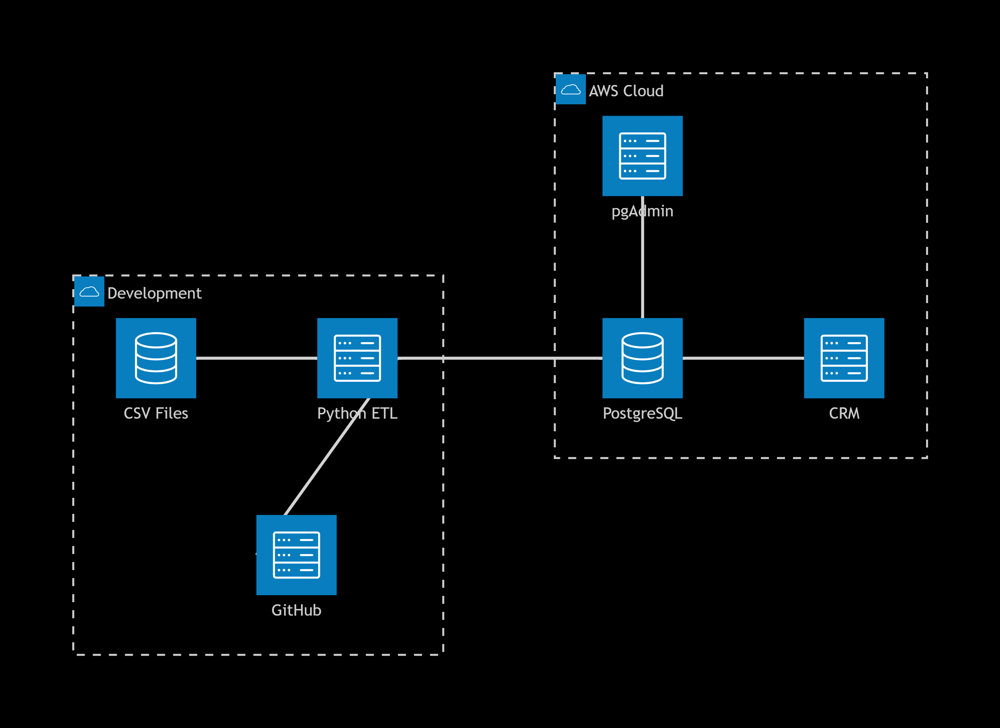

# Projeto Open Database Receita Federal

## Visão Geral

Este projeto implementa um pipeline completo de ETL (Extração, Transformação e Carga) para processar os dados públicos do Cadastro Nacional da Pessoa Jurídica (CNPJ) disponibilizados pela Receita Federal do Brasil.

## Escopo dos Dados

|Entidade |	Arquivo Fonte |
|Empresas |	empresas.csv  |
|Estabelecimentos |	estabelecimentos.csv |
|Sócios | socios.csv |
|CNAEs | cnaes.csv |

## Arquitetura do Sistema

O projeto segue uma arquitetura moderna de pipeline de dados, dividida em camadas de responsabilidade.



## Modelagem de Dados

A modelagem foi desenvolvida seguindo as melhores práticas de normalização de dados relacionais, garantindo integridade referencial e eficiência nas consultas.

## Diagrama Entidade-Relacionamento (DER)


## Fontes de Dados Oficiais

Todos os dados processados são provenientes de fontes oficiais do governo brasileiro:

### Portal de Dados Abertos da Receita Federal

Base CNPJ Completa: https://www.gov.br/receitafederal/pt-br/acesso-a-informacao/dados-abertos/cnpj

Documentação Técnica: https://www.gov.br/receitafederal/pt-br/assuntos/orientacao/tributaria/cadastros/cnpj/manual-de-instrucoes-do-cnpj

## Pré-requisitos

### Software Necessário

Python 3.9+
PostgreSQL 13+ (local para desenvolvimento)/AWS RDS PostgreSQL
pgAdmin 4 (para gerenciamento do banco)
Git (controle de versão)

## Processamento por Entidade

### 1. CNAEs (analise_cnaes.py)

Leitura do arquivo cnaes.csv
Extração dos campos: cnae_fiscal, descricao

### 2. Empresas (analise_empresas.py)
Leitura do arquivo empresas.csv
Extração dos campos: cnpj_basico, razao_social, natureza_juridica, qualificacao_responsavel e porte_empresa

### 3. Estabelecimentos (analise_estabelecimentos.py)
Leitura do arquivo estabelecimentos.csv
Extração dos campos: cnpj_basico, ordem, dv, identificador_matriz_filial, nome_fantasia, situacao_cadastral, cnae_fiscal_principal, logradouro, uf, email

### 4. Sócios (analise_socios.py)
Leitura do arquivo socios.csv
Extração dos campos: cnpj_basico, identificador_de_socio, qualificacao_do_socio, nome_do_socio

## Como Executar

### 1. Clone o repositório
```bash
git clone https://github.com/Gustavomedeirost/open-database-receita-federal.git
cd open-database-receita-federal

```
### 2. Execute os arquivos
```
python analise_cnaes.py
python analise_empresas.py
python analise_estabelecimentos.py
python analise_socios.py
```
## Conformidade Legal

LGPD (Lei 13.709/2018): Adequado por meio da anonimização de dados pessoais
LDO 2018 (Lei 13.473/2017): Segue a determinação de ocultação de dígitos do CPF
Lei de Acesso à Informação (12.527/2011): Dados mantidos públicos conforme determinação

## Contribuição

Contribuições são bem-vindas! Por favor, siga estas etapas:

Fork o projeto
Crie uma branch para sua feature (git checkout -b feature/AmazingFeature)
Commit suas mudanças (git commit -m 'Add some AmazingFeature')
Push para a branch (git push origin feature/AmazingFeature)
Abra um Pull Request

## Licença

Este projeto está licenciado sob a MIT License - veja o arquivo para detalhes.

## Contato e Suporte

Autor: Gustavo Medeiros
Email: gusmedeirost@gmail.com
LinkedIn: www.linkedin.com/in/gustavo-medeirost
Issues: GitHub Issues

## Agradecimentos

Receita Federal do Brasil pela disponibilização dos dados abertos
Comunidade Python pelas bibliotecas essenciais
AWS pela infraestrutura em nuvem
Contribuidores que ajudam a melhorar este projeto

### Se este projeto te ajudou, considere dar uma estrela no GitHub!
